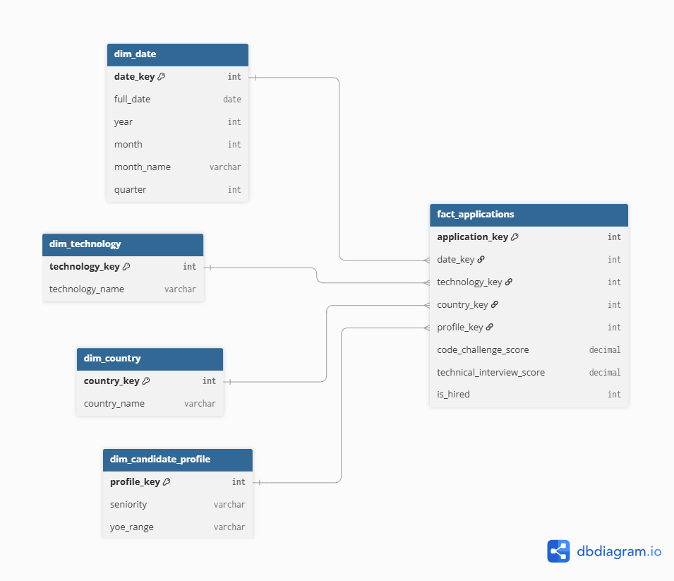
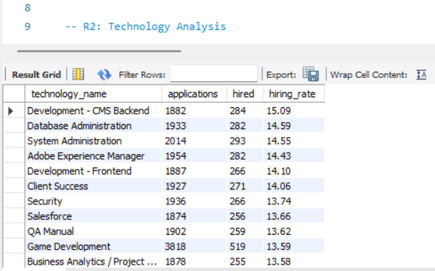
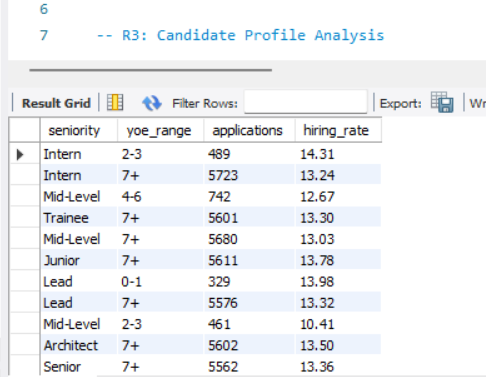
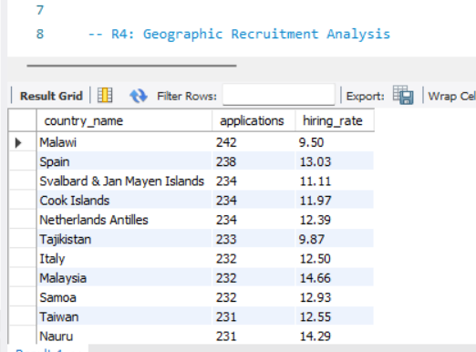
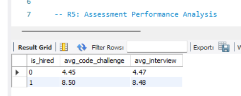

# Workshop 1 — From Business Requirements to a Dimensional Data Warehouse

**Course:** ETL (G01) — Data Engineering and Artificial Intelligence

---

## 1. Project Objective

The objective of this project is not simply to build a Data Warehouse, but to design and implement a complete **analytical data system** that transforms raw candidate application data into a **Dimensional Data Warehouse** capable of answering specific business questions and supporting recruitment decisions.

The project follows the engineering workflow:

```
Business Requirements → Data Understanding → Dimensional Modeling → ETL →
Data Warehouse → Analytics → Business Decisions
```

---

## 2. Business Context

A technology recruitment company receives thousands of candidate applications from different countries, seniority levels, technologies, and experience backgrounds. Each candidate is evaluated through two technical assessments:

- **Code Challenge Score**
- **Technical Interview Score**

Currently, this information only exists as raw application data. The company needs an analytical system that allows decision-makers to understand hiring patterns and evaluate recruitment performance from multiple perspectives (time, technology, geography, and candidate profile).

**Hiring business rule:**

```
HIRED = (Code Challenge Score >= 7) AND (Technical Interview Score >= 7)
Otherwise: NOT HIRED
```

This rule is applied during the ETL transformation step, not in the source data.

---

## 3. Business Requirements

| ID | Business Requirement | Business Question | Decision Supported |
|---|---|---|---|
| R1 | Hiring Trends | How have hiring outcomes changed across different time periods? | Determine whether recruitment performance is improving, worsening, or stable, to plan recruitment campaigns and staffing accordingly. |
| R2 | Technology Analysis | Which technologies generate the largest number and highest proportion of hired candidates? | Prioritize sourcing and recruitment effort toward technologies with better hiring outcomes. |
| R3 | Candidate Profile Analysis | How do hiring outcomes differ across candidate seniority levels and years of experience? | Adjust recruitment criteria or expectations per seniority/experience segment. |
| R4 | Geographic Recruitment Analysis | Which countries generate the highest volume of applications, and how does their hiring success rate compare? | Prioritize sourcing investment in countries with strong volume **and** high hiring success, and re-evaluate strategy in countries with high volume but low success. |
| R5 | Assessment Performance Analysis | Is there a meaningful gap between Code Challenge and Technical Interview performance, and does one assessment disqualify more candidates than the other? | Decide whether the difficulty, weighting, or preparation support of a specific assessment stage should be adjusted. |

> **Note:** R4 and R5 are proposed requirements for this project. Both are analytical, decision-oriented, answerable with the available data, and distinct from R1–R3.

---

## 4. Requirements Traceability

| Requirement | Business Question | Data Required | Expected Analytical Output |
|---|---|---|---|
| R1 | How have hiring outcomes changed over time? | Application Date, Hiring Outcome | Number/rate of hires per month and year (trend over time) |
| R2 | Which technologies generate the most and the highest proportion of hires? | Technology, Hiring Outcome | Ranking of technologies by hire count and hire rate (%) |
| R3 | How do hiring outcomes differ by seniority and years of experience? | Seniority, YOE, Hiring Outcome | Hire rate broken down by seniority level and YOE range |
| R4 | Which countries generate the highest application volume, and how do their hiring rates compare? | Country, Hiring Outcome | Ranking of countries by application volume and hire rate |
| R5 | Is there a meaningful gap between the two assessment scores, and does one disqualify more candidates? | Code Challenge Score, Technical Interview Score, Hiring Outcome | Average score comparison by outcome, and count of candidates disqualified by each assessment individually |

> This table was completed before any table was designed, following the workshop's instruction to start from what the business needs to know rather than from the data structure.

---

## 5. Dataset Description

The source dataset (`data/raw/candidates.csv`) contains **50,000 candidate applications**, where each row represents one application to a technical position.

| Column | Description |
|---|---|
| First Name | Candidate's first name |
| Last Name | Candidate's last name |
| Email | Candidate's email |
| Application Date | Date the application was submitted |
| Country | Candidate's country |
| YOE | Years of professional experience |
| Seniority | Candidate seniority level |
| Technology | Technology/profile the candidate applied for |
| Code Challenge Score | Score obtained in the code challenge (0–10) |
| Technical Interview Score | Score obtained in the technical interview (0–10) |

**Note:** the raw CSV uses `;` as the column separator rather than `,`, which was accounted for during extraction.

---

## 6. Main Profiling Findings

Profiling was performed in `notebooks/data_profiling.ipynb` before any modeling or transformation decision was made.

- **Rows / Columns:** 50,000 rows × 10 columns.
- **Missing values:** none found in any column (0 nulls across all 10 columns).
- **Duplicate records:** none found (0 fully duplicated rows).
- **Application Date range:** 2018-01-01 to 2022-07-04 (~4.5 years, last year partial).
- **Unique countries:** 244.
- **Seniority levels (7):** Intern, Trainee, Junior, Mid-Level, Senior, Lead, Architect.
- **Unique technologies:** 24.
- **YOE range:** 0 to 30 years (mean ≈ 15.3).
- **Code Challenge Score / Technical Interview Score range:** both 0 to 10, mean ≈ 5.0, std ≈ 3.17 for each.

**Conclusion:** the dataset is clean enough (no nulls, no duplicates) to move directly into dimensional modeling, with minimal data preparation required — mainly type casting for the date column, text standardization as a precaution, and applying the hiring business rule. No columns needed to be dropped or imputed.

---

## 7. Business Process

**Business process:** *Candidate Application Evaluation* — the process, within the technical recruitment pipeline, in which a candidate applies for a position, is scored through two technical assessments (Code Challenge and Technical Interview), and receives a hiring outcome (HIRED / NOT HIRED).

**Justification:** all five business requirements (R1–R5) analyze this exact process from different angles — time (R1), technology (R2), candidate profile (R3), geography (R4), and assessment behavior (R5) — but all of them ultimately measure the same underlying event: *an application being evaluated and resolved into a hiring outcome*. No other process (e.g., "interview scheduling" or "candidate onboarding") is supported by the available data.

---

## 8. Grain Definition

> **One row in `fact_applications` represents one individual candidate application** — one candidate, applying for one technology profile, on one application date, with its corresponding Code Challenge Score, Technical Interview Score, and derived hiring outcome.

This grain matches the source data (each row in `candidates.csv` is already one application) and is fine enough to support all five requirements — none of them require a coarser or finer level of detail (e.g., no requirement needs per-question or per-interviewer detail).

---

## 9. Star Schema Diagram



```
                    dim_date
                       |
dim_technology --- fact_applications --- dim_country
                       |
              dim_candidate_profile
```

One central fact table (`fact_applications`) connected to four dimension tables, each using its own surrogate key. Diagram built with [dbdiagram.io](https://dbdiagram.io).

---

## 10. Explanation of Dimensions and Facts

### Dimensions

| Dimension | Purpose | Main Attributes | Requirement(s) Supported |
|---|---|---|---|
| `dim_date` | Provides temporal context to analyze hiring trends over time. | `date_key (PK)`, `full_date`, `year`, `month`, `month_name`, `quarter` | R1 |
| `dim_technology` | Groups applications by the technology profile applied for. | `technology_key (PK)`, `technology_name` | R2 |
| `dim_candidate_profile` | Groups applications by candidate seniority and experience range. | `profile_key (PK)`, `seniority`, `yoe_range` | R3 |
| `dim_country` | Groups applications by candidate country for geographic analysis. | `country_key (PK)`, `country_name` | R4 |

`Code Challenge Score` and `Technical Interview Score` were **deliberately not** turned into dimensions: they are continuous numeric attributes, not low-cardinality categorical values, so they stay as descriptive measures in the fact table.

### Facts / Measures — `fact_applications`

| Measure | Meaning | Source / Calculation | Requirement(s) Supported | Additive? |
|---|---|---|---|---|
| `is_hired` | Whether the application resulted in a hire | Derived: `(Code Challenge Score >= 7) AND (Technical Interview Score >= 7)` | R1, R2, R3, R4, R5 | Yes — `SUM` gives total hires, `AVG` gives hire rate |
| `application_count` | Number of applications | Implicit — `COUNT(*)` over `fact_applications` | R1, R2, R3, R4 | Yes |
| `code_challenge_score` | Score obtained in the code challenge (0–10) | Source column | R5 | No — use `AVG`, not `SUM` |
| `technical_interview_score` | Score obtained in the technical interview (0–10) | Source column | R5 | No — use `AVG`, not `SUM` |

### Model Validation Against Requirements

| Requirement | Dimension(s) Required | Measure(s) Required | Supported? |
|---|---|---|---|
| R1 | dim_date | is_hired, application_count | Yes |
| R2 | dim_technology | is_hired, application_count | Yes |
| R3 | dim_candidate_profile | is_hired, application_count | Yes |
| R4 | dim_country | is_hired, application_count | Yes |
| R5 | *(none needed — fact-level only)* | code_challenge_score, technical_interview_score, is_hired | Yes |

All five requirements are covered by the current model — no additional dimensions or measures were required.

---

## 11. ETL Architecture

The pipeline follows a strict **ETL** approach (transformation happens before loading), orchestrated end to end by `src/main.py`:

```
candidates.csv → extract.py → transform.py → dimensional_model.py → load.py → recruitment_dw (MySQL)
```

Each module has a single responsibility, matching the folder structure under `src/`:

- **`extract.py`** — reads the raw CSV (`;`-separated) into a Pandas DataFrame. No business transformations happen here.
- **`transform.py`** — cleans the data (`clean()`: type casting, text standardization, duplicate/null handling) and applies the business rule and derived attributes (`apply_business_rules()`: `is_hired`, `yoe_range`).
- **`dimensional_model.py`** — builds the 4 dimension tables with surrogate keys and the fact table, joining the prepared data against each dimension. A row-count assertion (`assert len(fact) == len(df)`) guards against accidental row duplication or loss during the joins.
- **`load.py`** — creates the `recruitment_dw` MySQL database if it doesn't exist (`ensure_database_exists()`), loads dimensions first and then the fact table, then applies primary/foreign key constraints (`apply_constraints()`) and validates the load (`validate_load()`: row counts per table and a check for orphan foreign keys in `fact_applications`).
- **`main.py`** — runs the full pipeline in order and prints a final row count as a basic sanity check.

The resulting schema (tables, primary keys, and foreign keys) is also documented independently in `sql/create_tables.sql`, so the Data Warehouse structure can be inspected or recreated without running the Python pipeline.

This separation keeps the pipeline reproducible: each stage can be run, tested, or debugged independently, and the whole process is re-runnable end to end with a single command.

### 11.1 Implementation

**`extract.py`** — reads the raw CSV, no transformations:
```python
import pandas as pd


def extract(path='data/raw/candidates.csv'):
    """Lee el CSV original de candidatos."""
    df = pd.read_csv(path, sep=';')
    return df
```

**`transform.py`** — cleaning and business rules:
```python
import pandas as pd


def clean(df):
    """Limpia el DataFrame: nombres de columnas, tipos, duplicados y nulos."""
    df = df.copy()

    df.columns = [c.strip() for c in df.columns]
    df['Application Date'] = pd.to_datetime(df['Application Date'], errors='coerce')
    df['Country'] = df['Country'].str.strip().str.title()
    df['Seniority'] = df['Seniority'].str.strip().str.title()
    df['Technology'] = df['Technology'].str.strip()

    df = df.drop_duplicates()
    df = df.dropna(subset=['Application Date', 'Code Challenge Score', 'Technical Interview Score'])

    return df


def apply_business_rules(df):
    """Aplica la regla de contratación y crea columnas derivadas."""
    df = df.copy()

    df['is_hired'] = (
        (df['Code Challenge Score'] >= 7) &
        (df['Technical Interview Score'] >= 7)
    ).astype(int)

    bins = [-1, 1, 3, 6, 100]
    labels = ['0-1', '2-3', '4-6', '7+']
    df['yoe_range'] = pd.cut(df['YOE'], bins=bins, labels=labels)

    return df
```

**`dimensional_model.py`** — builds dimensions and the fact table with surrogate keys:
```python
def build_dim_date(df):
    dates = df[['Application Date']].drop_duplicates().reset_index(drop=True)
    dates['date_key'] = dates.index + 1
    dates['year'] = dates['Application Date'].dt.year
    dates['month'] = dates['Application Date'].dt.month
    dates['month_name'] = dates['Application Date'].dt.strftime('%B')
    dates['quarter'] = dates['Application Date'].dt.quarter
    dates = dates.rename(columns={'Application Date': 'full_date'})
    return dates


def build_dim_technology(df):
    tech = df[['Technology']].drop_duplicates().reset_index(drop=True)
    tech['technology_key'] = tech.index + 1
    tech = tech.rename(columns={'Technology': 'technology_name'})
    return tech


def build_dim_country(df):
    country = df[['Country']].drop_duplicates().reset_index(drop=True)
    country['country_key'] = country.index + 1
    country = country.rename(columns={'Country': 'country_name'})
    return country


def build_dim_profile(df):
    profile = df[['Seniority', 'yoe_range']].drop_duplicates().reset_index(drop=True)
    profile['profile_key'] = profile.index + 1
    return profile


def build_fact(df, dim_date, dim_tech, dim_country, dim_profile):
    fact = df.merge(dim_date, left_on='Application Date', right_on='full_date')
    fact = fact.merge(dim_tech, left_on='Technology', right_on='technology_name')
    fact = fact.merge(dim_country, left_on='Country', right_on='country_name')
    fact = fact.merge(dim_profile, on=['Seniority', 'yoe_range'])

    assert len(fact) == len(df), "Error de integridad: el merge duplicó o perdió filas"

    fact = fact[[
        'date_key', 'technology_key', 'country_key', 'profile_key',
        'Code Challenge Score', 'Technical Interview Score', 'is_hired'
    ]].reset_index(drop=True)

    fact = fact.rename(columns={
        'Code Challenge Score': 'code_challenge_score',
        'Technical Interview Score': 'technical_interview_score'
    })

    fact['application_key'] = fact.index + 1
    return fact
```

**`load.py`** — creates the database, loads tables, and adds constraints:
```python
from sqlalchemy import create_engine, text

DB_USER = 'root'
DB_PASSWORD = 'root'
DB_HOST = 'localhost'
DB_PORT = '3306'
DB_NAME = 'recruitment_dw'


def get_engine(with_db=True):
    db_part = f'/{DB_NAME}' if with_db else ''
    url = f'mysql+pymysql://{DB_USER}:{DB_PASSWORD}@{DB_HOST}:{DB_PORT}{db_part}'
    return create_engine(url)


def ensure_database_exists():
    engine = get_engine(with_db=False)
    with engine.connect() as conn:
        conn.execute(text(f'CREATE DATABASE IF NOT EXISTS {DB_NAME}'))
        conn.commit()


def apply_constraints(engine):
    """Agrega llaves primarias y foráneas después de cargar los datos."""
    ddl = [
        "ALTER TABLE dim_date ADD PRIMARY KEY (date_key)",
        "ALTER TABLE dim_technology ADD PRIMARY KEY (technology_key)",
        "ALTER TABLE dim_country ADD PRIMARY KEY (country_key)",
        "ALTER TABLE dim_candidate_profile ADD PRIMARY KEY (profile_key)",
        "ALTER TABLE fact_applications ADD PRIMARY KEY (application_key)",
        "ALTER TABLE fact_applications ADD CONSTRAINT fk_date "
        "FOREIGN KEY (date_key) REFERENCES dim_date(date_key)",
        "ALTER TABLE fact_applications ADD CONSTRAINT fk_tech "
        "FOREIGN KEY (technology_key) REFERENCES dim_technology(technology_key)",
        "ALTER TABLE fact_applications ADD CONSTRAINT fk_country "
        "FOREIGN KEY (country_key) REFERENCES dim_country(country_key)",
        "ALTER TABLE fact_applications ADD CONSTRAINT fk_profile "
        "FOREIGN KEY (profile_key) REFERENCES dim_candidate_profile(profile_key)",
    ]
    with engine.connect() as conn:
        for stmt in ddl:
            conn.execute(text(stmt))
        conn.commit()


def validate_load(engine):
    """Verifica conteo de filas y ausencia de referencias huérfanas."""
    with engine.connect() as conn:
        checks = {
            'date_key': 'dim_date', 'technology_key': 'dim_technology',
            'country_key': 'dim_country', 'profile_key': 'dim_candidate_profile',
        }
        for fk_col, dim_table in checks.items():
            orphans = conn.execute(text(f"""
                SELECT COUNT(*) FROM fact_applications f
                LEFT JOIN {dim_table} d ON f.{fk_col} = d.{fk_col}
                WHERE d.{fk_col} IS NULL
            """)).scalar()
            if orphans > 0:
                raise ValueError(f'{orphans} referencias inválidas en {fk_col}')
    print('Validación completa: sin referencias huérfanas.')


def load(dim_date, dim_tech, dim_country, dim_profile, fact):
    ensure_database_exists()
    engine = get_engine()

    dim_date.to_sql('dim_date', engine, if_exists='replace', index=False)
    dim_tech.to_sql('dim_technology', engine, if_exists='replace', index=False)
    dim_country.to_sql('dim_country', engine, if_exists='replace', index=False)
    dim_profile.to_sql('dim_candidate_profile', engine, if_exists='replace', index=False)
    fact.to_sql('fact_applications', engine, if_exists='replace', index=False)

    apply_constraints(engine)
    validate_load(engine)
    print(f'Base de datos "{DB_NAME}" creada/actualizada en MySQL.')
```

**`main.py`** — orchestrates the full pipeline:
```python
import os
from extract import extract
from transform import clean, apply_business_rules
from dimensional_model import (
    build_dim_date, build_dim_technology, build_dim_country,
    build_dim_profile, build_fact
)
from load import load


def run():
    raw = extract()
    cleaned = clean(raw)
    enriched = apply_business_rules(cleaned)

    dim_date = build_dim_date(enriched)
    dim_tech = build_dim_technology(enriched)
    dim_country = build_dim_country(enriched)
    dim_profile = build_dim_profile(enriched)
    fact = build_fact(enriched, dim_date, dim_tech, dim_country, dim_profile)

    os.makedirs('data/processed', exist_ok=True)
    dim_date.to_csv('data/processed/dim_date.csv', index=False)
    dim_tech.to_csv('data/processed/dim_technology.csv', index=False)
    dim_country.to_csv('data/processed/dim_country.csv', index=False)
    dim_profile.to_csv('data/processed/dim_candidate_profile.csv', index=False)
    fact.to_csv('data/processed/fact_applications.csv', index=False)

    load(dim_date, dim_tech, dim_country, dim_profile, fact)
    print('Pipeline completo. Filas en fact_applications:', len(fact))


if __name__ == '__main__':
    run()
```

---

## 12. Main Transformation Decisions

Decisions applied in `transform.py`, and why:

| Decision | Reasoning |
|---|---|
| `Application Date` cast to `datetime` | Required to build `dim_date` and to group by year/month/quarter for R1. |
| `Country` and `Seniority` stripped of whitespace and standardized to title case | Prevents accidental duplicate dimension members (e.g., `"Spain"` vs `"spain "` becoming two different `dim_country` rows). |
| `Technology` stripped of whitespace only (casing left as-is) | Profiling confirmed the 24 technology values already come consistently capitalized in the source file. Applying title case here would distort names that don't follow standard capitalization rules (e.g., `"QA Manual"` → `"Qa Manual"`, `"DevOps"` → `"Devops"`), so only whitespace is trimmed to avoid introducing errors while still preventing accidental duplicates from stray spaces. |
| Duplicate rows dropped | Defensive step — profiling found 0 duplicates in the current file, but the pipeline still checks so it stays correct if the source file is refreshed later. |
| Rows with missing `Application Date`, `Code Challenge Score`, or `Technical Interview Score` dropped | These three fields are required to compute the grain and the business rule; profiling confirmed there were none to drop in the current file. |
| `is_hired` computed as `(Code Challenge Score >= 7) AND (Technical Interview Score >= 7)` | Exact business rule required by the assignment. Stored as 0/1 so it works both as a filter and as an additive measure (`SUM(is_hired)` = total hires). |
| `YOE` bucketed into ranges (`0-1`, `2-3`, `4-6`, `7+`) as `yoe_range` | Needed to build `dim_candidate_profile` and answer R3 at a readable grain, instead of grouping by 31 individual YOE values. |
| No additional derived columns created | R4 and R5 are fully answerable with existing attributes (`Country`, both scores, `is_hired`) — extra columns were avoided to follow the assignment's instruction not to transform data without analytical purpose. |
| Primary/foreign key constraints applied after loading (`load.py`) | `pandas.to_sql()` only creates columns and infers types — it does not create constraints. `apply_constraints()` explicitly adds `PRIMARY KEY` on every surrogate key and `FOREIGN KEY` references from `fact_applications` to each dimension, so referential integrity is enforced at the database level, not just assumed from the ETL logic. |
| Post-load validation (`load.py`) | `validate_load()` checks row counts per table and confirms there are zero orphan foreign keys in `fact_applications` (i.e., every `date_key`, `technology_key`, `country_key`, and `profile_key` in the fact table matches a real row in its dimension). The pipeline raises an error and stops if any orphan is found, instead of silently loading bad data. |

---

## 13. Technologies

| Layer | Technology |
|---|---|
| Language | Python 3 |
| Data manipulation | Pandas |
| Initial profiling | Jupyter Notebook (VS Code) |
| Data Warehouse | **MySQL 8** |
| DB driver (Python) | PyMySQL (via SQLAlchemy) |
| Version control | Git + GitHub |
| BI Visualization | Power BI (connected directly to MySQL via ODBC) |

---

## 14. Instructions to Run the Project

### 14.1 Prerequisites
- Python 3.10+
- MySQL Server installed and running locally (administered with MySQL Workbench)
- The `root` password defined during MySQL Server installation

### 14.2 Set up the Python environment
```bash
python -m venv venv
venv\Scripts\Activate.ps1        # Windows PowerShell
pip install -r requirements.txt
```

### 14.3 Configure the database connection
Edit `src/load.py` and set `DB_PASSWORD` to your local MySQL root password.

### 14.4 Run the initial profiling (optional but recommended)
Open `notebooks/data_profiling.ipynb` in VS Code and run all cells.

### 14.5 Run the ETL pipeline
```bash
python src/main.py
```
This single command runs the full pipeline end to end: Extract → Clean/Transform → Business Rules → Dimensional Modeling → **create the `recruitment_dw` database if it doesn't exist** → Load dimensions → Load fact table → apply primary/foreign key constraints → validate referential integrity. It can be re-run safely at any time — it replaces the tables instead of duplicating rows.

### 14.6 Run the analytical queries
Open `sql/analytical_queries.sql` in MySQL Workbench (connected to `recruitment_dw`) and run each query to reproduce the R1–R5 analytical outputs below.

### 14.7 Connect the BI tool
Point Power BI directly at the `recruitment_dw` MySQL database via an ODBC connection (`Get Data → ODBC`, using a System DSN configured for `127.0.0.1:3306` with SSL disabled) to reproduce the visualizations. See `powerbi/recruitment_dw.pbix` for the saved report.

---

## 15. Analytical Queries and KPIs

All results below were generated directly from the Data Warehouse (`fact_applications` joined with its dimensions), using the queries in `sql/analytical_queries.sql`. Each query is followed by a screenshot of the actual result set produced in MySQL Workbench.

### R1 — Hiring Trends
**Business question:** How have hiring outcomes changed over time?
```sql
SELECT d.year, d.month, COUNT(*) AS applications,
       SUM(f.is_hired) AS hired,
       ROUND(100.0 * SUM(f.is_hired) / COUNT(*), 2) AS hiring_rate
FROM fact_applications f
JOIN dim_date d ON f.date_key = d.date_key
GROUP BY d.year, d.month
ORDER BY d.year, d.month;
```


**Result (monthly hiring rate, 2018–2022):** the rate fluctuates consistently between ~11.4% and ~15.7% across all 55 months, with no sustained upward or downward trend.

**Interpretation:** hiring outcomes are stable year over year. This suggests the hiring outcome is driven by candidate performance on the two assessments rather than by seasonal or year-over-year shifts in recruitment strategy.

### R2 — Technology Analysis
**Business question:** Which technologies generate the largest number and highest proportion of hired candidates?
```sql
SELECT t.technology_name, COUNT(*) AS applications,
       SUM(f.is_hired) AS hired,
       ROUND(100.0 * SUM(f.is_hired) / COUNT(*), 2) AS hiring_rate
FROM fact_applications f
JOIN dim_technology t ON f.technology_key = t.technology_key
GROUP BY t.technology_name
ORDER BY hiring_rate DESC;
```



**Result (top / bottom):** *Development - CMS Backend* has the highest hiring rate (15.09%); *Social Media Community Management* has the lowest (11.69%). *Game Development* and *DevOps* receive by far the most applications (3,818 and 3,808 — roughly double any other technology) but only mid-range hiring rates (13.59% and 13.00%).

**Interpretation:** application volume and hiring quality are not correlated — the most popular technologies are not the ones with the best outcomes, which matters for where sourcing budget should actually go.

### R3 — Candidate Profile Analysis
**Business question:** How do hiring outcomes differ by seniority and years of experience?
```sql
SELECT p.seniority, p.yoe_range, COUNT(*) AS applications,
       ROUND(100.0 * SUM(f.is_hired) / COUNT(*), 2) AS hiring_rate
FROM fact_applications f
JOIN dim_candidate_profile p ON f.profile_key = p.profile_key
GROUP BY p.seniority, p.yoe_range;
```



**Result:** hiring rate stays close to the ~13% overall average across almost every seniority/experience combination. The clearest outliers are *Intern* candidates with 0-1 years of experience (highest observed rate, 19.42%) and *Mid-Level* candidates with 2-3 years (lowest, 10.41%).

**Interpretation:** seniority and years of experience, on their own, are weak predictors of hiring outcome in this dataset — the technical assessments appear to be the real gatekeepers, not the candidate's declared background.

### R4 — Geographic Recruitment Analysis
**Business question:** Which countries generate the highest application volume, and how does their hiring success rate compare?
```sql
SELECT c.country_name, COUNT(*) AS applications,
       ROUND(100.0 * SUM(f.is_hired) / COUNT(*), 2) AS hiring_rate
FROM fact_applications f
JOIN dim_country c ON f.country_key = c.country_key
GROUP BY c.country_name
ORDER BY applications DESC;
```



**Result:** applications are spread almost evenly across 244 countries (roughly 150–250 each; the top country, Malawi, has only 242). Hiring rate ranges from ~7.6% (Saint Vincent and the Grenadines, Guam, Montenegro) up to ~22.6% (Northern Mariana Islands).

**Interpretation:** no country dominates recruitment volume, so there is no natural "top market." The wide spread in hiring rate is largely explained by the small per-country sample size (~150–250 applications) rather than a genuine geographic effect, which is an important caveat before using this data to justify country-level sourcing decisions.

### R5 — Assessment Performance Analysis
**Business question:** Is there a meaningful gap between the two assessments, and does one disqualify more candidates than the other?
```sql
SELECT is_hired,
       ROUND(AVG(code_challenge_score), 2) AS avg_code_challenge,
       ROUND(AVG(technical_interview_score), 2) AS avg_interview
FROM fact_applications
GROUP BY is_hired;
```



**Result:**

| Outcome | Avg Code Challenge | Avg Technical Interview |
|---|---|---|
| NOT HIRED | 4.45 | 4.47 |
| HIRED | 8.50 | 8.48 |

**Interpretation:** hired candidates score about 4 points higher on both assessments, and the two scores stay close to each other within each group — indicating the two assessments move together and both contribute meaningfully to the hiring outcome, consistent with the business rule requiring both scores ≥ 7.

---

## 15.1 Power BI Dashboard

The Data Warehouse was connected directly to Power BI via an ODBC System DSN (`Get Data → ODBC`, pointing at `recruitment_dw` on `127.0.0.1:3306`). The report file is available at `powerbi/recruitment_dw.pbix`.

The dashboard includes four visualizations, covering the required temporal analysis, comparative analysis, and an analysis tied to R4/R5:

### Diagram 1 — Hiring Trend Over Time (R1)
**KPI:** `Hiring Rate = DIVIDE(SUM(fact_applications[is_hired]), COUNTROWS(fact_applications)) * 100`, plotted by year/month.


**Interpretation:** confirms the same finding as the R1 SQL query — the monthly hiring rate stays within a stable band across the full 2018–2022 period, with no clear upward or downward trend.

### Diagram 2 — Hiring Rate by Technology (R2)
**KPI:** `Hiring Rate` broken down by `dim_technology[technology_name]`, sorted descending.


**Interpretation:** visually confirms that the highest-volume technologies (Game Development, DevOps) are not the ones with the best hiring rates — *Development - CMS Backend* leads in hire rate despite lower application volume.

### Diagram 3 — Application Volume and Hiring Rate by Country (R4)
**KPI:** Application count and `Hiring Rate` broken down by `dim_country[country_name]`.


**Interpretation:** shows the even distribution of applications across the 244 countries and highlights how hiring-rate outliers correspond to countries with small sample sizes, reinforcing the caution noted in the R4 SQL interpretation.

### Diagram 4 — Assessment Score Comparison by Outcome (R5)
**KPI:** `Avg Code Challenge = AVERAGE(fact_applications[code_challenge_score])` and `Avg Interview = AVERAGE(fact_applications[technical_interview_score])`, grouped by `is_hired`.


**Interpretation:** hired candidates (`is_hired = 1`) average close to 8.5 on both assessments, while non-hired candidates (`is_hired = 0`) average close to 4.5 on both — the two assessments move together within each group, meaning neither one disqualifies disproportionately more candidates than the other.

---

## 16. Main Business Findings

1. **Hiring outcomes are stable over time** (R1): the hire rate stayed within a narrow band (~11.4%–15.7%) from 2018 to mid-2022, with no major disruption to recruitment performance.
2. **Volume ≠ quality in technology sourcing** (R2): *Game Development* and *DevOps* receive the most applications but not the best hiring rates; *Development - CMS Backend* offers the best hiring rate.
3. **Seniority and experience are weak predictors of hiring outcome** (R3): hire rate barely moves across seniority levels or experience ranges — assessment performance appears to be the actual differentiator, not the candidate's declared background.
4. **Geographic application volume is evenly distributed, but hiring rate is not** — with the caveat that the differences are noisy given small per-country samples (R4).
5. **The two technical assessments behave consistently with each other** (R5): hired and non-hired candidates show closely matching averages on both scores, supporting the idea that both assessments are equally informative gatekeepers.

**Overall takeaway:** the organization's hiring outcome is driven primarily by assessment performance rather than by *who* is applying (seniority, experience, or country). This suggests recruitment strategy could have more impact by focusing on candidate preparation/screening ahead of the assessments, rather than by targeting specific seniority levels or geographies.

---

## 17. Final Requirements Validation

| Requirement | Implemented? | DW Tables Used | Query / KPI | Main Finding |
|---|---|---|---|---|
| R1 | Yes | `fact_applications`, `dim_date` | Monthly applications/hires/hire rate | Hire rate stable, ~11.4%–15.7% across the full period |
| R2 | Yes | `fact_applications`, `dim_technology` | Hiring rate ranking by technology | CMS Backend has the best rate (15.09%); high-volume technologies are only mid-range |
| R3 | Yes | `fact_applications`, `dim_candidate_profile` | Hiring rate by seniority + YOE range | Rates cluster near 13% regardless of seniority/experience |
| R4 | Yes | `fact_applications`, `dim_country` | Hiring rate and volume by country | Volume is even across 244 countries; hiring-rate spread is largely sample-size noise |
| R5 | Yes | `fact_applications` | Average scores by hiring outcome | Hired candidates average ~4 points higher on both assessments |

**Does the final Data Warehouse provide enough information to satisfy all five business requirements?**
Yes. Every requirement can be answered directly from `fact_applications` joined with its dimensions, without going back to the source CSV or an intermediate DataFrame.

**Does the dimensional model contain elements that are not justified by the analytical requirements?**
No. Each of the 4 dimensions (`dim_date`, `dim_technology`, `dim_candidate_profile`, `dim_country`) maps to exactly one requirement's grouping need, and every fact table attribute (`code_challenge_score`, `technical_interview_score`, `is_hired`) is used by at least one requirement.

**What business decisions can now be supported by the implemented analytical system?**
- Prioritize sourcing effort toward technologies with above-average hire rates, not just above-average volume (R2).
- Avoid over-weighting seniority or years of experience as recruitment filters, since neither strongly predicts hiring outcome (R3) — assessment performance matters more.
- Treat the two technical assessments as consistent, comparably weighted gatekeepers (R5); no immediate evidence one needs to be recalibrated relative to the other.
- Monitor the year-over-year hire rate (R1) as an early signal if future process changes start affecting outcomes, and treat country-level hire-rate differences (R4) with caution given limited sample sizes per country.
